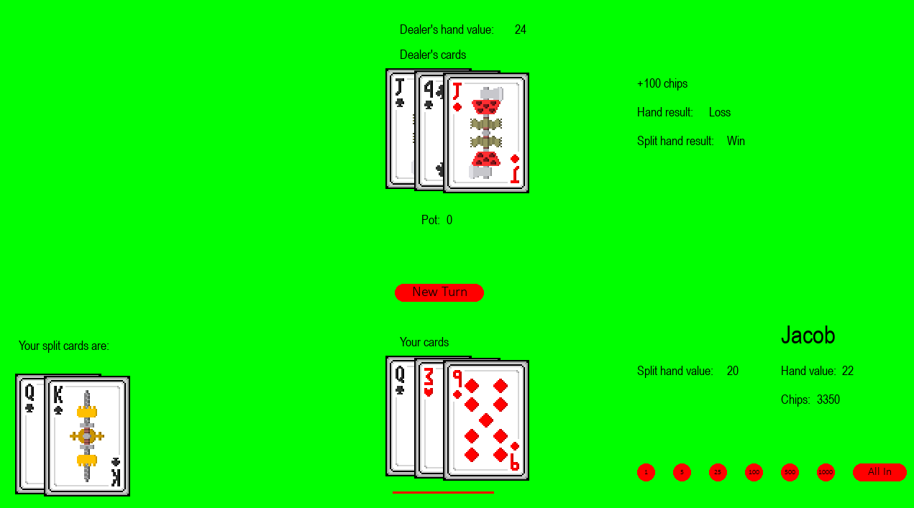
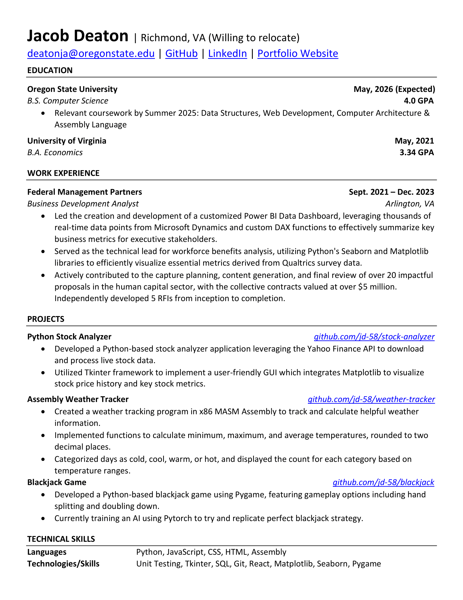

## About Me 👋

Hello! My name is Jacob, and I am currently enrolled at Oregon State University, studying Computer Science through their Ecampus. Read on to learn more about me, or visit my [portfolio website!](https://www.jacob-deaton.com/)

After 2 years of working as a Business Development Analyst in government contracting, I realized that my true passion was coding! I started my Computer Science degree at Oregon State University in June of 2024, and am projected to graduate in August of 2026.

## Education 📖
_- Current:_ **Oregon State University,** B.S. in Computer Science | June 2024 - May 2026 (Expected) | 4.0 GPA

_- Previous:_ **University of Virginia,** B.A. in Economics | August 2017 - May 2021 | 3.34 GPA

## Projects 💻
### **[Stock Analyzer App](https://github.com/jd-58/stock-analyzer)** - Python
A Python program that uses the Yahoo Finance API to download and display live stock data. Custom Tkinter was used to create a GUI, along with Matplotlib to create the graph. For more information, including instructions for how to run the project on your machine, click on the link to go to the repository!

### **[Weather Tracker Program](https://github.com/jd-58/weather-tracker)** - Assembly
A program built in x86 MASM Assembly that will track user-entered daily temperature readings, and output helpful statistics such as the minimum, maximum, and average temperature. It will also tell the user how many cold, cool, warm, and hot days there were!

### **[Blackjack Game](https://github.com/jd-58/blackjack)** - Python
A blackjack game made using Python and Pygame. Currently training an AI to play the game using Pytorch! The game is based on US Casino rules, including splitting (up to 3 hands per turn), doubling down, and late surrender. For more information, including instructions for how to run the project on your machine, click on the link to go to the repository!

### **[Etch-a-Sketch](https://github.com/jd-58/etch-a-sketch)** - _[Demo](https://www.jacob-deaton.com/etch-a-sketch.html)_ - HTML, CSS, JavaScript
A drawing program based on the classic Etch-A-Sketch toy. Features include a color selection button (including a "Random Color" option that automatically chooses a random color for each grid cell as you draw), grid size selector, and the ability to clear the grid. Click the "Demo" button to try it out, or click on the link to go to the repository! 

### **[Portfolio Website](https://www.jacob-deaton.com/)** - HTML, CSS
A portfolio website that I created from scratch using HTML and CSS! The website showcases my projects, resume, and hosts my Etch-a-Sketch project.

## Work Experience ✏️
_Business Development Analyst_, FMP Consulting | Sept. 2021 – Dec. 2023

- Led the creation and development of a customized Power BI Data Dashboard, leveraging thousands of real-time data points from Microsoft Dynamics and custom DAX functions to effectively summarize key business metrics for executive stakeholders.
- Served as the technical lead for workforce benefits analysis, utilizing Python's Seaborn and Matplotlib libraries to efficiently visualize essential metrics derived from Qualtrics survey data.
- Actively contributed to the capture planning, content generation, and final review of over 20 impactful proposals in the human capital sector, with the collective contracts valued at over $5 million. Independently developed 5 RFIs from inception to completion.

## Resume 📝
If you'd like to download a copy, head to my [portfolio website!](https://www.jacob-deaton.com/index.html#resume)

## Contact Me 📫

<!--
**jd-58/jd-58** is a ✨ _special_ ✨ repository because its `README.md` (this file) appears on your GitHub profile.

Here are some ideas to get you started:

- 🔭 I’m currently working on ...
- 🌱 I’m currently learning ...
- 👯 I’m looking to collaborate on ...
- 🤔 I’m looking for help with ...
- 💬 Ask me about ...
- 📫 How to reach me: ...
- 😄 Pronouns: ...
- ⚡ Fun fact: ...
-->
